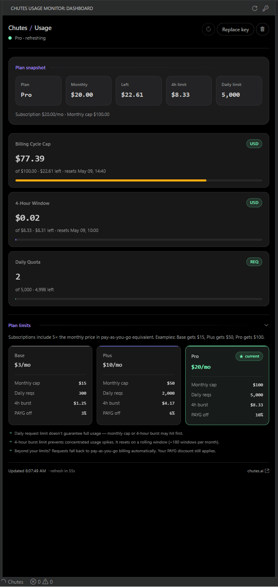

# Chutes Usage Monitor

Monitor Chutes subscription usage, rolling limits, and request quotas directly inside VS Code.

This is an unofficial third-party extension and is not affiliated with or endorsed by Chutes.

## Installation

Install the extension from the [Visual Studio Code Marketplace](https://marketplace.visualstudio.com/items?itemName=mikesoft.chutes-usage-vscode):

- `mikesoft.chutes-usage-vscode`

After installation:

1. Open the Command Palette.
2. Run `Chutes Usage Monitor: Set API Key`.
3. Open the `Chutes Usage Monitor` view from the Activity Bar.

## Features

- Sidebar dashboard aligned with the chutes.ai look: pure-black on dark themes, pill buttons, mint pill badges, headline-violet section titles, generous whitespace
- Theme-aware: backgrounds, foregrounds, borders, and description text follow VS Code theme tokens; works with Light, Dark, and High Contrast themes
- Plan snapshot, per-window usage cards with progress bars, and a Plan Limits reference that highlights your current tier
- PAYG credit tile showing your pay-as-you-go account balance, with amber/red warnings when the balance runs low or reaches zero
- Compact status bar summary with severity-aware codicon and background color; full detail in the tooltip
- Secure API key storage through VS Code `SecretStorage`
- Manual refresh command for immediate sync
- Automatic refresh on a configurable timer, when the dashboard becomes visible again, and when the VS Code window regains focus
- Live `refresh in Ns` countdown driven by your `refreshIntervalSeconds` setting
- Cached state restore on side-panel reopen — no `Loading…` flash, no flicker on every tick
- Accessible by default: ARIA progressbar/alert/status semantics, `prefers-reduced-motion` support, and visible focus rings
- Hardened webview CSP with a per-load nonce and scoped `font-src`/`img-src`

## Latest Changes

- `0.5.2` improves legal documentation, trademark notices, third-party terms references, and project metadata.
- `0.5.1` updates the TypeScript build to Node16 module resolution and TypeScript 7.
- `0.5.0` adds a PAYG credit tile to the plan snapshot showing your pay-as-you-go account balance (with low/empty-balance warnings and a status bar tooltip line), and improves plan snapshot accessibility with ARIA-labelled figures.

See the [changelog](CHANGELOG.md) for the complete release history.

## Commands

- `Chutes Usage Monitor: Open Dashboard`
- `Chutes Usage Monitor: Refresh`
- `Chutes Usage Monitor: Set API Key`
- `Chutes Usage Monitor: Remove API Key`

## Settings

- `chutesUsageVscode.refreshIntervalSeconds`: Refresh interval in seconds. Default: `60`
- `chutesUsageVscode.showStatusBar`: Show or hide the status bar item. Default: `true`

## How It Works

The extension shows your current Chutes usage in two places:

- the `Chutes Usage Monitor` sidebar dashboard for full details
- the optional status bar item for a compact summary and quick access back to the dashboard

The sidebar dashboard includes:

- a compact header with sync state and actions
- a plan snapshot with the most relevant subscription figures, including your pay-as-you-go credit balance
- stacked usage cards optimized for narrow Activity Bar layouts
- a `Plan Limits` reference section that uses pricing data when available without exposing a raw quota payload table

The dashboard refreshes when you run the refresh command, on the configured refresh interval, when the dashboard becomes visible again, and when VS Code regains window focus.

Settings changes for refresh interval and status bar visibility apply immediately without reloading the extension.

## Known Limitations

- Chutes quota metering may lag behind live requests.
- When daily quota data cannot be verified reliably, the extension shows `--` instead of a potentially misleading `0`.
- Some API responses are normalized defensively because endpoint shapes may evolve over time.
- Temporary refresh errors keep the last successful dashboard snapshot visible when possible.

## Privacy And Storage

- Your Chutes API key is stored using VS Code `SecretStorage`.
- The extension uses the key only to request your own usage data.
- The extension does not keep a local history of usage data.
- On uninstall, the extension performs best-effort cleanup of its local extension storage.

## Documentation

- [User guide](docs/user-guide.md)
- [Troubleshooting](docs/troubleshooting.md)
- [Documentation index](docs/README.md)
- [Contributing](CONTRIBUTING.md)
- [Support](SUPPORT.md)
- [Security](SECURITY.md)

## Support The Project

If Chutes Usage Monitor helps you track quotas from VS Code, support continued maintenance through GitHub Sponsors: [github.com/sponsors/TheStreamCode](https://github.com/sponsors/TheStreamCode).

## License

Project-created code and materials are available under the [MIT License](LICENSE).
See [NOTICE](NOTICE) for trademark, logo, non-affiliation, and Chutes provider
terms/privacy notices. This is an unofficial third-party extension and is not
affiliated with or endorsed by Chutes.
